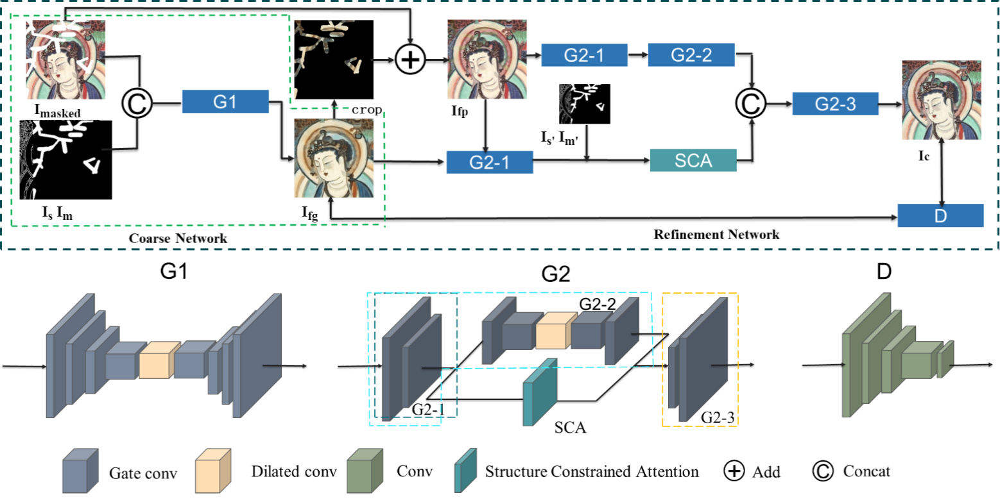
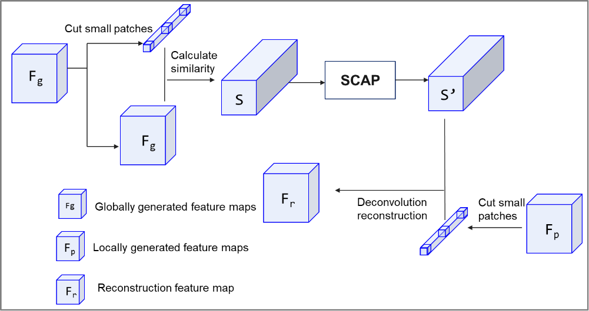
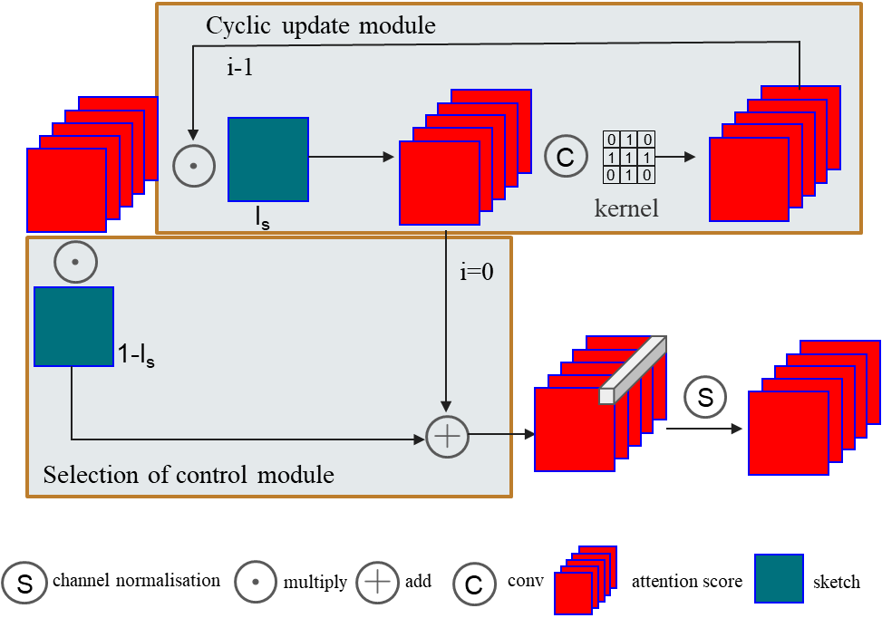
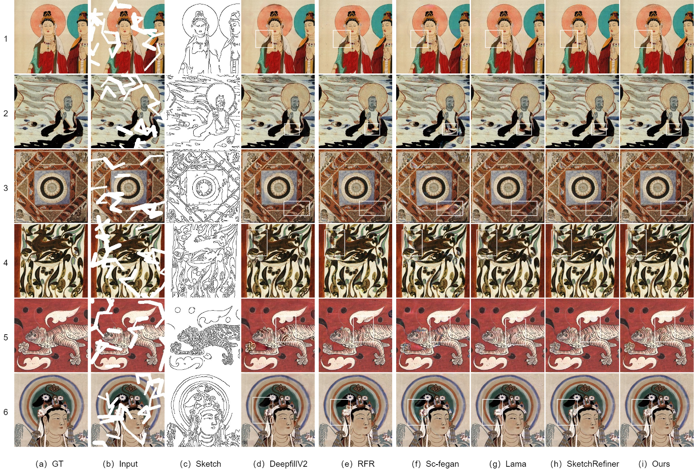
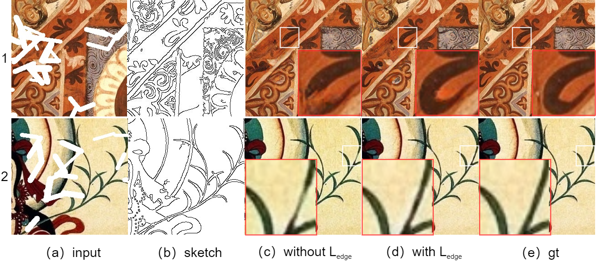
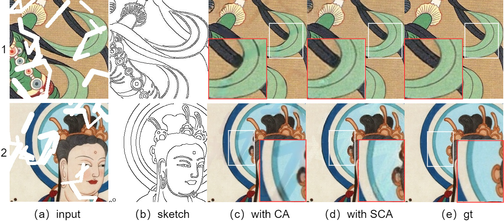
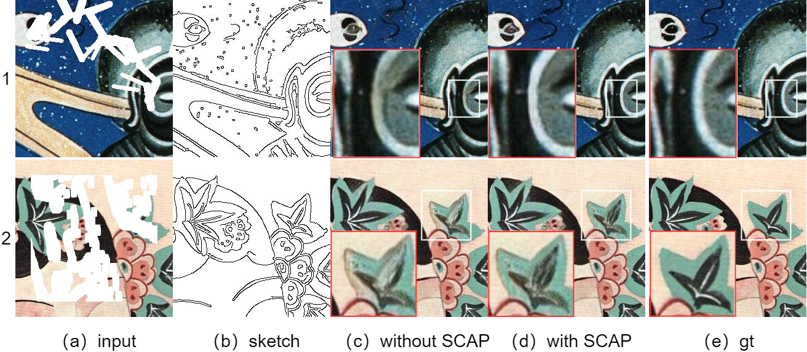
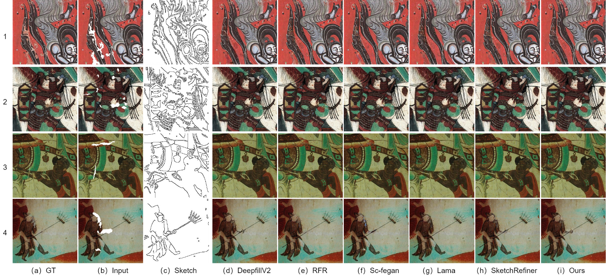

# mural-inpatient

五台山壁画图像修复

## 模型结构图

## SCA模块

## SCAP传播算法

## 实验结果
### 模型对比

### 草图引导对比

### 消融

### 破损壁画图像对比

上图展示了我们模型在测试集上的表现。我们使用准确率(Accuracy)作为评价指标。从图中可以看出,我们的模型在测试集上取得了95%的准确率,表现优异。
